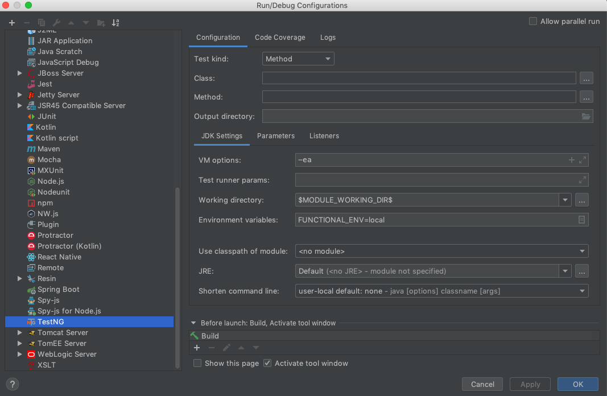
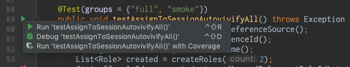
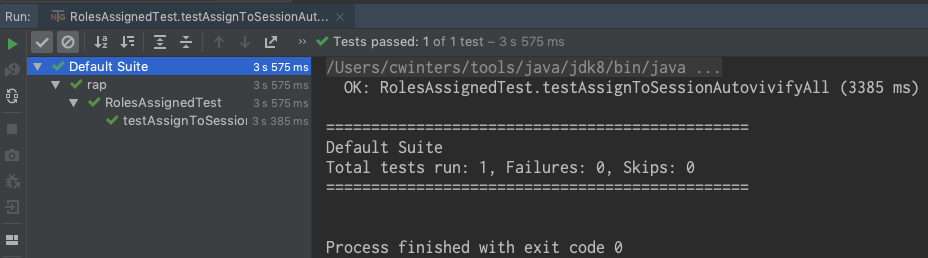
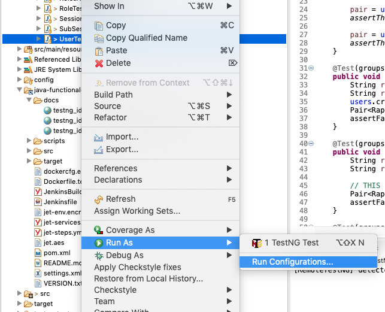
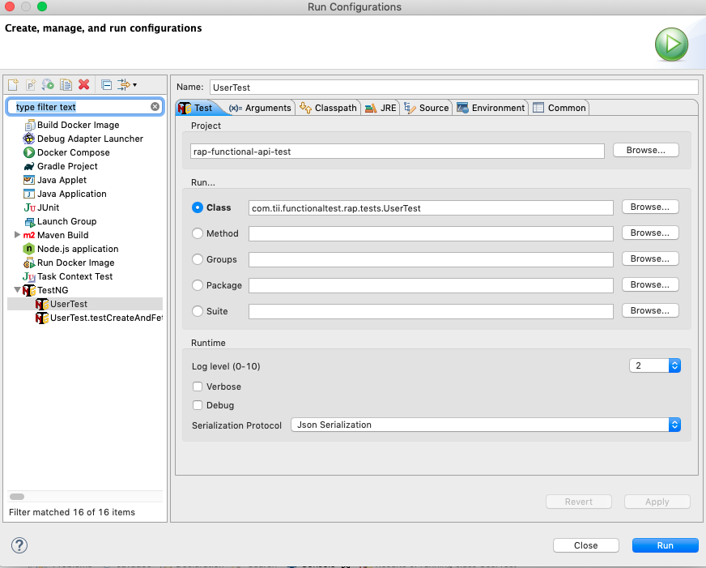
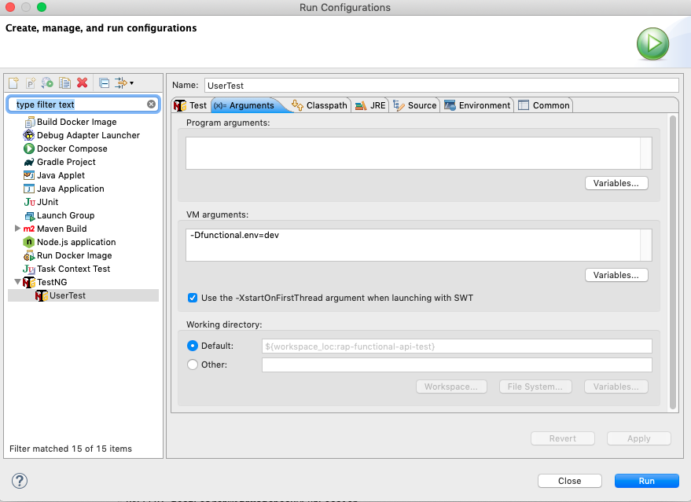

# README: Java Functional Testing Library

This library provides a base for Java functional tests of API services in
ExamSoft.  Functional tests can overlap in functionality to unit tests with one
key difference -- unit tests generally invoke functions and pass parameters
like any other code, while functional tests treat the service under test as a
black box and issue HTTP commands to fetch and mutate data.

This library helps you create functional tests for your services by providing
the abstractions to issue HTTP commands and verify the results, and doing so at
the microservice API level rather than just the HTTP protocol level. URLs
should be embedded in library provided by each service to access it (therefore
you don't need to mess with them). And instead of dealing with maps or abstract
JSON objects are return types you'll work with POJOs that know how to take care
of serialization (so you don't need to mess with date formats or fat fingering
key names). 

This is a pretty slim library. The idea is that every microservice will build
its own abstractions and make them available for other projects to use, which
will be particularly helpful for functional tests that communicate with
multiple microservices to do their jobs.

## create and run your Java 11 project using Eclipse:
1. From the top bar, select Window -> Preferences -> Java -> Installed JREs, then click on Add...
2. Keep Standard VM selected, then click on Next >
3. Browse and select your JDK installation folder by clicking on Directory , then click on Finish.
4. Click on Apply and Close.

## Building project for eclipse
```
on linux/mac
	./gradlew eclipse

on windows
	gradlew eclipse
	
Refresh project in eclipse to reflect changes
```

## Abstractions

The basic abstractions we'll work with are:

* `services` that issue HTTP requests to a Redwood service; these are generally
  broken out by functional area of the service so they can be fairly focused.
* `serializers` that represent the fields and objects transferred from the
  Redwood service; note that they don't have to represent the full set of data
  returned, only what you need.
* `fake data` so you can generate random but semi-meaningful data for the
  objects you create
* `cleanup` a set of functions to both register objects you create (or that are
  created on your behalf) as well as the means to delete them once the test
  suite is run

### Abstraction: fake data

When creating transactions against systems the data you use in them winds up
being a sticky issue. You need to make sure that tests that know nothing about
each other don't use the same identifiers or names, but you'd also like to make
the data semi-meaningful. And if possible you want to make it easy to identify
as testing data in case cleanup fails.

We're building on top of [java-faker](https://github.com/DiUS/java-faker) to
generate the data and there's a class you can subclass to get its functionality
and make domain-specific identifiers. 
### Abstraction: serializer

A serializers turns data from the system under test into objects which are
easier to manipulate than maps or JSON object abstractions. They are the
plainest of POJOs, and typically filled by [Gson](https://github.com/google/gson),
which doesn't need public fields, constructor args, or setters.

This is almost entirely done in services, so the base service class has the
ability to turn text from various sources into JSON with the `fromJson` method.
So you can do something like:

```java
package com.github.ravi005e.myapp.test;

import com.es.functionaltest;
import com.es.myapp.serializers;
import org.testng.annotations.Test;

public class MyTest extends FunctionalTest {
    private MyObjectService myObjects = new MyObjectService();

    @Test
    public Pair<MyObject, ValidatableResponse> testThatThing() {
        ...
        ValidatableResponse respnose = myObjects.fetchThatThing(someId);
        MyObject result = fromJson(response, MyObject.class);
        return Pair.with(result, response);
    }
}
```

### Abstraction: service

Services are the objects that sit between your test and the system under test.
Typically they'll:

* assemble data you provide into an HTTP requests and path,
* do some basic inspections on the response,
* turn data in the response into objects, and
* return as a tuple those object(s) plus the response to the caller

There's a base class in this library
`com.github.ravi005e.functionaltest.service.BaseService` that has some objects
you'll need and methods to turn response data into objects. (It's not required
to overload.)

Services that create data must issue cleanup commands, like:

```java
Cleanup.forRemoval(myObject);
```

These commands *register* the object for deletion at the end of the test suite,
they don't delete the object immediately. ( below.)

### Abstraction: cleanup

One of the things the base `com.github.ravi005e.functionaltest.FunctionalTest` test
does is issue a cleanup command at the end that deletes objects we've created.
But there's no magic to that command, it does most of its work by delegating to
microservice-specific implementations of
`com.github.ravi005e.functionaltest.ServiceCleanup` that perform the actual deletes.

Those implementations only know about those lists of objects because they're explicitly
registered. Services should register objects whenever they're created, like:

```

That `myCleanup.forRemoval(...)` line is where we register the object for
removal, and it needs to be implemented in every microservice functional
testing library.

Sometimes objects are created implicitly as part of another process.
Recommended practice is to register them for deletion whenever you verify their
existence -- because a good functional will want to verify their existence!


Remember that we're just *registering* these objects for deletion, not actually deleting them.

When you implement functional tests for a new services you'll need your own
`com.es.functionaltest.ServiceCleanup` implementation. You'll also need to
register it with the main cleanup class so it knows to delegate when it's time.
One thing your implementation must take care to do is remove objects in the
correct order so that foreign key constraints within your service aren't
violated. 

## Running tests

##### Install TestNG framework in eclipse

```
1. Click on Help in menu bar
2. choose Install New Software
3. Click on Add button
... TestNG for Eclipse
... https://testng.org/testng-eclipse-update-site
```

Tests are run using `gradle test`. However there is a required parameter for the 
environment that you are running against. This can be done by either setting the 
environment var `functional.env` or passing in the system var with -D as `FUNCTIONAL_ENV`


You can run the tests locally or via Jenkins. But you can also run individual
test classes and methods from your IDE. You can also run them in a debugger to
inspect what's going on.

To do that you'll need the TestNG plugin for your favorite IDE:

* IDEA (TestNG plugin is bundled with modern IntelliJ's)
* [Eclipse](https://github.com/cbeust/testng-eclipse/)

In IDEA once you do that you'll have a template under "Run > Edit
Configurations...". Once you get there add an environment variable to point to
the environment you want to run your test against (e.g., `local`) so it'll look
something like this:



Once you do that you can run individual tests by clicking on the green arrow
next to the function name:



and then the results will look like:


<br></br><br></br>  
Running/Debugging test with eclipse IDE

NOTE: Run test class/method first, then follow the steps below. Makes it lot easier to configure.
  
Launching configuration


Test configuration


VM configuration

 
Finally, Click on Debug/Run button.


Note that choosing 'Debug' instead of 'Run' does the same thing, but if you've
set breakpoints in your testing code you'll be able to see the stack and
context when the process halts.

## Writing tests

It's not required, but the base class `com.es.functionaltest.FunctionalTest`
will do a few things for you:

In a `@BeforeSuite` function we'll:

* Check the environment variable `FUNCTIONAL_DEBUG` or system property
  `functional.debug` and, if set to "true" will both set the root logging level
  to `DEBUG` and flip the correct bits to record full request/response traffic
  in `test-output/traffic.log`.
* Use the environment variable `FUNCTIONAL_ENV` or system property
  `functional.env` to register the URL we should be hitting along with any
  other properties. The value should be the name of the environment you want to
  run your tests against, one of:
    * local: hitting `localhost:8000`
    * docker: hitting `host.docker.internal:8000`


And in an `@AfterSuite` function we'll invoke the cleanup routines.

## Implementing a new project?

### Gradle dependency

You'll need to ensure you have access to either of our internal library
repositories (Artifactory) and then add this, with possible
variances for the version:

```
dependencies {
	implementation 'com.github.ravi005e:java-api-testlib:1.5-SNAPSHOT'
}
```

### Resources for creating response schema

[Free Online JSON to JSON Schema Converter](https://www.liquid-technologies.com/online-json-to-schema-converter)


Follow on-screen instructions

